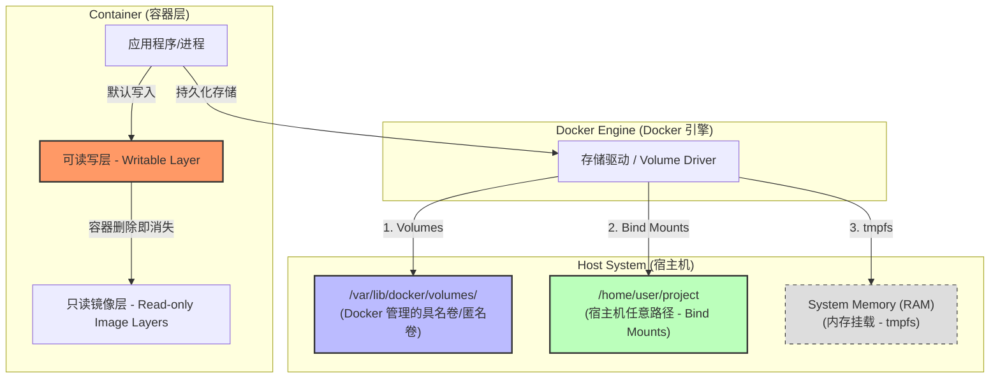

### 引言：容器的“短暂人生”与数据的“永恒追求”

### 1. 一场关于“消失”的悲剧

想象一下，你刚刚通宵达旦，通过 Docker 启动了一个 MySQL 数据库，并在里面辛辛苦苦录入了上万条核心业务数据。你看着程序运行平稳，心满意足地敲下命令：

```bash
docker rm -f my-mysql  # 删掉旧容器，准备升级镜像
docker run ...         # 启动新版本容器

```

当你满心期待地连上数据库，准备大干一场时，你看到的不是熟悉的表单，而是一片死寂的“0 rows”。

**在那一秒钟，你的心跳停了。** 你明明记得数据已经写进了数据库，为什么删掉容器后，数据也跟着“陪葬”了？

这种感觉就像你在一张**隐形墨水**写的纸上记账：只要纸还在，字看起来就在；可一旦这张纸被换掉，你所有的记录都会化为乌有。这，就是每个初学者在接触 Docker 持久化之前，必须经历的一场“血泪教训”。

### 2. 底层真相：为什么容器会“失忆”？

要理解这场悲剧，我们必须拆开 Docker 的黑盒子，看看它的文件系统是如何运作的。

Docker 采用的是 **联合文件系统（UnionFS）**。当你基于镜像启动一个容器时，Docker 会在那些“只读”的镜像层（Image Layers）之上，叠加一个薄薄的、**可读写层（Container Layer）**。

这里涉及到一个核心技术：**写时复制（Copy-on-Write, CoW）**。

- 如果你要修改镜像里的一个配置文件，Docker 会先把它从底层的只读层“复制”一份到最顶的可读写层，然后再进行修改。
- 你新增的数据、生成的日志、下载的文件，统统都存在这个最顶层的可读写层里。

**痛点就在这里：** 这个可读写层的生命周期是和容器绑定的。

容器在，数据在；**容器一旦被删除（rm），这个可读写层也会被彻底物理粉碎。** 在 Docker 的设计哲学里，容器应该是“不可变的（Immutable）”和“临时性的（Ephemeral）”，它就像一次性纸杯，用完即丢，不留痕迹。

### 3. 数据的永恒追求：给生命找个出口

然而，代码可以随时重跑，镜像可以随时重拉，但**数据（Data）是无价的**。数据库里的订单、用户的上传、系统的日志，这些资产不能随着容器的消亡而消失。

这就引出了我们今天的核心课题：**数据持久化**。

我们需要在容器那个脆弱的“生命周期”之外，寻找一个稳定的、长久的居住地。我们要让数据不再是容器的附庸，而是宿主机上独立存在的、能够被不同容器代代相传的“传家宝”。

在接下来的篇幅中，我们将深入解析 Docker 提供的三大“保命绝招”，教你如何把数据从虚幻的容器层引流到坚实的物理磁盘上，实现真正的**数据长生不老**。

---

### 一、 Docker 数据持久化的三大绝招

为了解决容器“失忆”的问题，Docker 并没有采取单一的补丁方案，而是根据不同的应用场景，设计了三套“保命绝招”。

理解这三者的区别，就像是理解“专业保险箱”、“自家储物间”和“临时便利贴”的区别。只有选对了方案，才能在性能、安全和便利性之间找到完美的平衡。



**图 1：Docker 数据存储架构全景**

如图所示，容器内的应用程序有四条数据去向：

1. **Writable Layer**：数据随容器生，随容器死。
2. **Volumes**：数据进入 Docker 托管的“安全区”，实现真正的持久化。
3. **Bind Mounts**：数据在容器与宿主机目录间实时同步，适合开发调试。
4. **tmpfs**：数据直接写入内存，追求极致性能且不落盘，适合存放敏感密钥。

---

### Volumes（卷）：由 Docker 托管的“专业保险箱”

这是 Docker 官方**最推荐**的持久化方式，也是最纯粹的 Docker 原生方案。

- **形象理解：** 它就像是在你的宿主机里开辟了一个“特区”。这个特区的钥匙归 Docker 管，你不必关心它具体存在硬盘的哪个角落（在 Linux 上通常是 `/var/lib/docker/volumes/`），你只需要给这个卷起个名字。
- **硬核干货：**
    - **独立性：** 它的生命周期完全独立于容器。你可以把卷挂载到容器 A，容器 A 删了，卷还在；下次启动容器 B，挂上同一个卷，数据瞬间“还魂”。
    - **平台无关性：** 无论你是在 Linux、Mac 还是 Windows 上跑 Docker，Volumes 的工作方式完全一致，Docker 帮你屏蔽了底层操作系统的文件系统差异。
    - **支持驱动：** 它可以支持高级玩法，比如把数据存到云端的 S3 或 NFS 远程存储。
- **适用场景：** 数据库（MySQL/Redis）、生产环境的长期数据存储。

### 2. Bind Mounts（绑定挂载）：直连宿主机的“自家储物间”

这种方式历史悠久，早在 Docker 早期就已经存在，它更像是宿主机与容器之间的一道“传送门”。

- **形象理解：** 它是强行把宿主机上的一个**具体路径**（比如 `/home/user/my_project`）关联到容器里的路径。
- **硬核干货：**
    - **完全透明：** 你在宿主机上修改一个文件，容器里立刻就能看到；反之亦然。
    - **依赖性强：** 它高度依赖宿主机的目录结构。如果你的路径写死了是 `C:\Users\Desktop`，那这份代码发给 Linux 同事就跑不通了。
    - **权限隐患：** 容器里的程序有权修改宿主机的这个目录，甚至可能删掉你的系统文件，安全性略低。
- **适用场景：** **代码开发调试**（本地改了代码，容器里的应用实时刷新）、共享宿主机的配置文件（如 `/etc/localtime`）。

### 3. tmpfs Mounts（内存挂载）：转瞬即逝的“临时便利贴”

如果你既不想把数据丢在容器里，也不想把它写到硬盘上，那么 `tmpfs` 是唯一的选择。

- **形象理解：** 它是在内存（RAM）里开辟了一块空间。既然是在内存里，那自然快得飞起，但一旦容器停止，数据就会彻底灰飞烟灭。
- **硬核干货：**
    - **极致性能：** 因为不涉及磁盘 IO，读写速度是三个方案中最恐怖的。
    - **高安全性：** 因为数据不写磁盘，即使别人拿到了你的硬盘，也找不回那些敏感数据。
- **适用场景：** 存放敏感的秘钥（Secrets）、高频生成的临时缓存文件。

---

### 💡 横向对比：建立全局观

为了方便你做决策，我整理了一张对比表：

| 特性 | Volumes (卷) | Bind Mounts (绑定挂载) | tmpfs Mounts (内存挂载) |
| --- | --- | --- | --- |
| **存储位置** | 宿主机的 Docker 管理区 | 宿主机的任意位置 | **宿主机的内存中** |
| **管理方式** | 由 Docker 统一管理 | 用户手动管理路径 | 用户管理 |
| **可移植性** | 高（不依赖宿主机路径） | 低（依赖特定路径） | 高 |
| **性能** | 优秀 | 优秀 | **极致（最高）** |
| **安全性** | 高（容器间隔离） | 较低（可修改宿主机） | 最高（不落盘） |
| **数据持久性** | **永久（除非手动删卷）** | **永久（除非手动删文件）** | **临时（停机即失）** |

### 二、 深度解析：Volumes vs. Bind Mounts（该选哪一个？）

在上一章我们初步认识了 Docker 持久化的三大绝招。但在实战中，开发者最常纠结的问题一定是：**既然都是存数据，到底该选 Volume 还是 Bind Mount？**

很多初学者会对这两者的边界感到模糊，甚至产生误解：Volume 是不是只能存在固定目录下？在 Windows 这种非 Linux 环境下，挂载又是如何实现的？这一章，我们将深入底层，拆解这两项技术的本质差异。

---

### 1. Volumes：由 Docker 托管的“数据沙盒”

针对很多人的疑问：**“Volume 是不是只能挂载在固定目录下？”**

答案是：**是的，但这正是它的优势。**

在 Linux 环境下，Volume 默认存储在 `/var/lib/docker/volumes/` 下。你可能会觉得这不够灵活，但请换个角度思考：

- **完全解耦（Abstraction）：** 你不需要记住宿主机上冗长的绝对路径，你只需要给卷起个名字（如 `db_data`）。无论你把镜像迁移到 Ubuntu、CentOS 还是 Windows，只要调用这个名字，Docker 就能精准地找到数据。
- **安全防误删：** 因为路径由 Docker 引擎独占管理，普通用户或非相关程序很难无意中修改或删除这些文件。这种“黑盒”管理模式极大地降低了生产环境的数据风险。
- **云端与分布式支持：** 这是 Volume 的杀手锏。通过**卷驱动程序（Volume Drivers）**，你可以创建一个挂载点，其实际存储可能是在远端的阿里云 OSS、AWS S3 或者公司内部的 NFS 存储上。对于容器里的程序来说，它只管往里写数据，底层跨越空间的复杂逻辑全由 Docker 搞定。

### 2. Bind Mounts：直连宿主机的“实时传送门”

如果说 Volume 是 Docker 帮你买的专业保险箱，那么 Bind Mount 就是你自己找的储物间。它允许你将宿主机上的**任何**现有目录（如本地的代码仓库、日志文件夹）关联到容器。

- **开发环境的“神：** 想象你在写代码，如果使用 Bind Mount 将本地源码目录挂载到容器，你在 VS Code 里保存代码的瞬间，容器内的应用就能感应到变化并实时刷新。**这种“零构建、实时见效”的体验，是开发者不二的选择。**
- **特定系统文件共享：** 当你需要让容器读取宿主机的 `/etc/localtime`（同步时区）或者读取宿主机的日志目录进行分析时，Bind Mount 是最直接的桥梁。

### 3. 性能与架构：Windows WSL2 下的“跨界”难题

对于在 Windows 上使用 Docker Desktop 的读者，这里有一个必须掌握的核心干货：**WSL2 下的挂载逻辑。**

- **原理：** Windows 版 Docker 运行在 WSL2（一个轻量级 Linux 内核）中。当你使用 Bind Mount 挂载 `C:\Users\Project` 时，数据其实是跨越了 Windows 和 Linux 两个完全不同的文件系统。
- **性能陷阱：** 这种“跨系统操作”涉及大量的底层协议转换（通常是 9P 协议）。如果你挂载了一个包含数万个小文件的项目（如 `node_modules`），容器运行速度会慢得让你怀疑人生。
- **避坑指南：**
    - **追求极速：** 请把代码放在 WSL2 的内部路径里（例如 `\\wsl$\Ubuntu\home\user\project`），从这里挂载到容器属于“Linux 到 Linux”，速度飞快。
    - **数据库数据：** **请务必使用 Volume。** 在 Windows/Mac 环境下，Volume 会被存储在 WSL2 专用的虚拟磁盘文件里，避开了跨文件系统的性能损耗，读写效率几乎等同于原生 Linux。

---

### 💡 深度总结：决策模型

为了帮你快速决策，请参考下表：

| 维度 | Volumes (推荐用于生产) | Bind Mounts (推荐用于开发) |
| --- | --- | --- |
| **存放位置** | Docker 管理的内部区域（隔离性好） | 宿主机任何位置（灵活性高） |
| **可移植性** | **极强**，不依赖具体宿主机路径 | 较弱，路径变了配置就失效 |
| **数据管理** | 使用 `docker volume` 命令统一管理 | 需手动操作宿主机文件系统 |
| **典型场景** | **数据库**、生产日志、文件上传存储 | **源码实时调试**、系统配置共享 |
| **WSL2 表现** | 性能非常稳定 | 跨分区挂载（C盘）时性能较差 |

---

### ⚠️ 直击心灵的建议：

如果你在部署一个**生产级数据库**，请永远选择 **Volumes**。因为它不仅能提供更好的性能，还能让你在未来进行容器迁移、备份和升级时，像呼吸一样自然，不再被宿主机的路径所束缚。

**小贴士：Docker 如何区分你是在挂载 Volume 还是路径？**

在敲下 `-v` 命令时，Docker 是个“细节控”。

- 想挂载**路径（Bind Mount）**？请务必以斜杠开头，如 `v /my/path:/data`。
- 想挂载**卷（Volume）**？请直接写名字，如 `v my_vol:/data`。

如果你想让你的脚本看起来更像“架构师”写的，建议尝试使用 `--mount` 语法。虽然它写起来长一点，但它通过 `type=bind` 或 `type=volume` 明确表达了你的意图，消除了歧义，也避免了因路径不存在而误创空文件夹的尴尬。

### 三、 实战：手把手教你持久化

理论说得再多，不如亲手敲几行命令。在这一章，我们将从具体的命令行操作入手，带你掌握 Docker 持久化的实战技巧。

---

在 Docker 中，挂载数据主要通过 `-v`（或 `--volume`）参数来实现。虽然参数看起来简单，但其中的细微差别决定了你以后管理数据的难度。

### 1. 匿名卷 vs. 具名卷：给你的数据起个名字

当你创建一个卷时，你有两种选择：随性而为，或者井然有序。

- **匿名卷 (Anonymous Volume)：**
    
    如果你只指定了容器内的路径，而没有指定名字：
    
    ```bash
    docker run -d -v /var/lib/mysql mysql:latest
    
    ```
    
    **后果：** Docker 会自动生成一串 64 位的随机字符作为卷名（比如 `e3b0c442...`）。
    
    **吐槽：** 这就像是你生了个孩子却没给起名，只给了个身份证号。当你以后想找回这个卷时，面对一堆乱码，你根本分不清哪个是数据库的，哪个是日志的。
    
- **具名卷 (Named Volume) —— 【推荐】：**
    
    给数据明确一个身份：
    
    ```bash
    docker run -d -v my_db_data:/var/lib/mysql mysql:latest
    
    ```
    
    **优势：** 无论容器删除了多少次，你只需要记住 `my_db_data` 这个名字。输入 `docker volume ls`，你能一眼认出它，管理起来极其优雅。
    

### 2. 只读挂载 (Read-only)：给容器加把锁

有时候，我们希望容器只能读取宿主机的数据，绝对不能修改。比如，你把一份珍贵的源码或配置文件挂载到容器里运行，但不希望容器里的程序由于 Bug 把你的源码给删了。

这时候，你需要在挂载路径后面加上 `:ro`：

```bash
docker run -d -v /home/user/config:/app/config:ro my-app

```

- **干货提示：** `:ro` 代表 **Read-Only**。此时，容器内部对 `/app/config` 的任何写操作都会被系统拒绝。这是一种极佳的安全防御手段，遵循了“最小权限原则”。

### 3. 在 Docker Compose 中配置：告别长命令

在实际开发中，我们很少手动敲又长又难记的 `docker run`。使用 **Docker Compose**，我们可以把这些配置写进 YAML 文件，像写文档一样管理持久化。

这是一个优雅的 `docker-compose.yml` 示例，展示了如何同时使用 **Volume** 和 **Bind Mount**：

```yaml
version: '3.8'
services:
  web:
    image: nginx:latest
    ports:
      - "8080:80"
    volumes:
      # 1. Bind Mount：将本地的 html 目录同步到 Nginx（方便改代码）
      - ./html:/usr/share/nginx/html:ro

      # 2. Named Volume：将日志存入由 Docker 管理的具名卷
      - nginx_logs:/var/log/nginx

# 在最顶层声明所有用到的具名卷
volumes:
  nginx_logs:

```

**💡 为什么这样配置最专业？**

- **./html (Bind Mount)**：相对路径挂载，让你的代码改动立刻在浏览器生效。加上 `:ro` 保证了 Nginx 容器不会意外修改你的源码。
- **nginx_logs (Named Volume)**：日志数据交给 Docker 托管。即使你执行 `docker-compose down` 销毁了整个服务，日志卷也会被保留下来，直到你手动删除它。

---

### 💡 避坑小贴士

1. **挂载覆盖问题：** 如果你把一个本地目录挂载到容器内一个**非空**的目录，宿主机的目录内容会“覆盖”掉容器内的原内容。新手常犯的错误是挂载错了路径，导致容器里的程序找不到原来的启动文件。
2. **创建顺序：** 在 Docker Compose 中，如果你定义了具名卷，Docker 会自动帮你创建。但在使用 `docker run -v` 挂载宿主机目录（Bind Mount）时，如果宿主机路径不存在，Docker 有时会自动帮你创建一个空文件夹（由 root 拥有），这可能会导致权限问题。**建议：始终手动创建好宿主机目录后再进行挂载。**

**掌握了这些命令，你已经可以游刃有余地管理容器数据了。下一部分，我们将以最常用的数据库（MySQL）为例，看看持久化在真实场景中是如何落地的。**

### 四、 场景模拟：以数据库为例（MySQL/PostgreSQL）

在 Docker 的世界里，数据库（Database）是数据持久化最硬核、也最频繁的使用场景。如果说普通应用的持久化只是“保存文件”，那么数据库的持久化则关乎**业务命脉**。

这一章，我们以 MySQL 为例，拆解在实战中如何正确地让数据库“落地生根”，并避开那些让新手崩溃的隐藏陷阱。

---

### 1. 核心配置：你的数据该往哪儿放？

每种数据库镜像都有其预设的数据存放路径。如果你挂载错了位置，容器重启后依然会面临“数据全丢”的惨剧。

- **MySQL / MariaDB**：默认路径是 `/var/lib/mysql`。
- **PostgreSQL**：默认路径是 `/var/lib/postgresql/data`。
- **Redis**：默认路径是 `/data`。

**实战命令示例：**

```bash
docker run -d \
  --name pro-mysql \
  -e MYSQL_ROOT_PASSWORD=my-secret-pw \
  -v mysql_data:/var/lib/mysql \
  mysql:8.0

```

**💡 专家建议：** 对于数据库，**强烈建议使用 Named Volume（具名卷）**。因为数据库对磁盘 IO 性能非常敏感，且其文件权限结构复杂，交给 Docker 引擎托管可以获得最佳的性能和兼容性，避免在宿主机文件系统中产生混乱。

### 2. 权限陷阱：让无数开发者挠头的 UID/GID 冲突

这是本章的**“深度干货”**。很多读者会发现，使用 **Bind Mount** 挂载数据库目录时，容器经常启动失败，日志报错：`Permission Denied`（拒绝访问）。

- **背后的真相：**Linux 权限系统只认 **UID（用户ID）**。你的宿主机用户可能是 `UID 1000`，但 MySQL 镜像内部运行程序的 `mysql` 用户可能是 `UID 999`。当你把宿主机一个由 `UID 1000` 创建的目录挂载进去时，容器里的 `mysql` 用户（UID 999）根本没有权限往里写数据。
- **如何解决？**
    - **方案 A（推荐）：** 还是那句话，**使用 Volume**。Docker 引擎在创建 Volume 时，会自动将该目录的所有权分配给容器内的正确用户，彻底规避权限问题。
    - **方案 B（如果你必须用 Bind Mount）：** 你需要在宿主机上手动修改目录权限：`sudo chown -R 999:999 ./my-mysql-data`。但这会让你的宿主机目录看起来很奇怪，因为它被一个“不存在的用户”接管了。

### 3. 环境与初始化：持久化如何与配置配合？

持久化不仅仅是“存数据”，还包括“怎么开始”。Docker 官方数据库镜像提供了一个非常优雅的机制：**`/docker-entrypoint-initdb.d/`**。

- **自动初始化：**如果你有一份 `init.sql` 脚本（创建表结构、插入初始数据），你可以将其挂载到容器的 `/docker-entrypoint-initdb.d/` 目录下。
- **运行逻辑：**当容器**第一次**启动且**数据目录为空**时，Docker 会自动执行这个目录下的所有 `.sql` 或 `.sh` 脚本。
- **持久化的联动：**一旦数据目录被持久化（有了数据），第二次启动时，Docker 就会跳过初始化过程，直接加载已有数据。这保证了你的数据库既能“自动化安装”，又能“持久化保存”。

**完整的 Docker Compose 示例：**

```yaml
services:
  db:
    image: mysql:8.0
    environment:
      MYSQL_DATABASE: my_app_db
      MYSQL_ROOT_PASSWORD: password
    volumes:
      # 数据持久化
      - db_data:/var/lib/mysql
      # 初始脚本挂载（只需读，所以加 :ro）
      - ./init.sql:/docker-entrypoint-initdb.d/init.sql:ro

volumes:
  db_data:

```

---

### 💡 深度总结

在处理数据库持久化时，请记住以下三原则：

1. **认准路径**：别把数据挂载到错误的目录。
2. **Volume 优先**：除非你要手动修改数据库文件，否则 Volume 是规避权限问题的最优解。
3. **初次启动意识**：利用初始化文件夹功能，实现“开箱即用”的一体化部署。

**很多同学会问：既然镜像里已经写了数据目录，我不写 `-v` 行不行？**

答案是：**行，但很不优雅。**

当你运行一个数据库镜像而不指定挂载参数时，Docker 会启动“自我保护机制”，自动为你创建一个**匿名卷**。数据确实存下来了，但它就像一张没有名字的存折，存在银行里（你的硬盘里）。

当你某天删除了容器，想找回这些数据时，你会发现硬盘里躺着几十个名字像 `ae32f...` 的文件夹。你无法辨认哪个才是你的“存折”。

**结论：** 永远要显式地指定挂载。手动指定不是为了告诉 Docker 数据在哪，而是为了给你的数据“取个名字”，让你拥有跨越容器生命周期的**绝对掌控权**。

**技术揭秘：为什么不指定挂载点，数据也不会立即丢失？**

很多同学好奇，我直接运行 `docker run mysql`，没写 `-v`，数据存哪了？

这得归功于镜像里的 **`VOLUME` 指令**。你可以把它理解为镜像自带的 **“数据安全补丁”** 。

官方镜像在制作时，就已经在内部给关键的数据文件夹打上了“持久化”标签。当你没有提供具名卷或宿主机路径时，Docker 会自动生成一个“匿名卷”来接管这些数据。

**所以，“镜像里写了路径”本质上是开发者为你提供的一层“安全底线”。** 但作为专业开发者，我们不应该依赖这种随机生成的底线，而是应该通过具名挂载，把主动权掌握在自己手里。

### 五、 进阶技巧：数据的备份与迁移

当你已经学会了如何挂载卷（Volume）来保护数据，你已经领先了 50% 的 Docker 用户。但剩下的 50% 用户会面临更现实的问题：**如果我的服务器要搬家怎么办？如果我想把昨天的数据库状态存个档，该怎么操作？**

Volume 就像是 Docker 内部的一个“黑盒”，直接去宿主机目录里暴力拷贝文件并不是最优雅、最安全的做法。在这一章，我们将学习如何像专业架构师一样管理数据的“迁徙”。

---

### 1. 备份：如何把 Volume 打包带走？

因为 Volume 存储在 Docker 的管理区，直接通过文件管理器找路径不仅麻烦（尤其在 Mac/Windows 上），还可能遇到文件权限问题。

**最专业的备份方式：使用临时容器进行“打包”。**

我们可以启动一个极小的临时容器，让它同时挂载“要备份的卷”和“你的本地目录”，然后把数据打成一个压缩包：

```bash
docker run --rm \
  --volumes-from pro-mysql \
  -v $(pwd):/backup \
  ubuntu \
  tar cvf /backup/mysql_backup.tar /var/lib/mysql

```

- **命令拆解：**
    - **`-rm`**：这是一个“临时工”容器，干完活（压缩完）就自动销毁，不占空间。
    - **`-volumes-from pro-mysql`**：直接继承 MySQL 容器的卷挂载点，不用再写一遍长长的路径。
    - **`v $(pwd):/backup`**：把当前宿主机目录映射到容器里的 `/backup`，用来接收压缩包。
    - **`tar cvf ...`**：在容器内执行压缩，把数据塞进 `mysql_backup.tar`。

### 2. 迁移：跨服务器搬家的“标准姿势”

当你有了这个 `.tar` 压缩包，数据搬家就变得极其简单。

- **步骤 A：传输文件。** 使用 `scp` 或云盘把 `mysql_backup.tar` 发送到新服务器。
- **步骤 B：恢复数据。** 在新服务器上，创建一个新卷并解压：
    
    ```bash
    # 1. 创建新卷
    docker volume create new_mysql_data
    # 2. 用临时容器解压还原
    docker run --rm \
      -v new_mysql_data:/restore \
      -v $(pwd):/backup \
      ubuntu \
      bash -c "tar xvf /backup/mysql_backup.tar -C /restore --strip 1"
    
    ```
    

**💡 为什么要这么麻烦，不用 `docker cp`？**

`docker cp` 确实可以把文件从容器拷贝出来，但它是一次性的。当你需要备份**整个卷**（包含复杂的权限和大量小文件）时，使用 `tar` 打包不仅能保持文件权限，还能减小传输体积，是工业界的标准做法。

### 3. 清理：别让“僵尸数据”吞噬你的硬盘

还记得我们之前提到的**匿名卷**吗？当你频繁运行和删除那些没有指定具名卷的容器时，你的硬盘里会堆积大量无人认领的匿名卷。

它们就像是“僵尸数据”，不占进程却占空间。

- **查看孤儿卷（没有被任何容器使用的卷）：**
    
    ```bash
    docker volume ls -f dangling=true
    
    ```
    
- **一键断舍离：注意：** 运行这个命令前请务必三思！它会删掉所有当前没有被任何容器挂载的卷。请确保你那些重要的具名卷至少挂在一个容器上，或者你已经提前做好了备份。
    
    ```bash
    docker volume prune
    
    ```
    

---

### 💡 专家心得：备份的意义

在 Docker 的哲学里，**“容器可以随时重启，但数据必须能够跨越空间。”**

- **具名卷（Named Volume）** 解决了本地持久化的问题。
- **定期备份（Backup）** 解决了容灾的问题。
- **迁移脚本（Migration）** 解决了扩展性的问题。

**当你掌握了这套备份、恢复、清理的闭环操作，你才真正算得上拥有了“数据自由”。**

---

### ⚠️ 直击心灵的最后忠告：

千万不要把备份文件也存在宿主机的 `/var/lib/docker` 路径下！一旦 Docker 引擎或整个宿主机磁盘损坏，你会体验到什么叫“鸡蛋放在一个篮子里”的绝望。**备份的终点，应该是云端存储或另一台独立的物理服务器。**

**“那么，Bind Mount 是不是更好备份？”**

没错。如果你使用的是 Bind Mount（将宿主机目录挂载进容器），你完全可以把这个目录当成普通的本地文件夹来处理。你可以用 `cp`、`tar` 或者你喜欢的任何备份软件直接对它进行操作，而不需要启动什么“备份容器”。

**但请记住一个黄金法则：** 无论你用哪种挂载方式，备份时都要注意“数据一致性”。最稳妥的方法是在备份前先 `docker stop` 停止容器，防止备份到一半时应用正在写入，导致数据包损坏。

### 六、迈向云端 —— 挂载远程与云存储

在掌握了本地持久化之后，很多开发者会面临更宏大的挑战：**“如果我有三台服务器都要读同一个数据目录怎么办？”** 或者 **“如果我的服务器硬盘由于物理故障坏了，数据怎么保命？”**

这时，我们就需要让 Docker 的数据卷走出“单机限制”，迈向**云端与远程存储**。

这一章，我们将解锁 Docker 数据管理的最高阶玩法：**使用 Volume Drivers（卷驱动）**。

---

### 1. 核心神器：Volume Drivers (卷驱动程序)

默认情况下，Docker 使用的是名为 `local` 的驱动，它把数据存放在宿主机硬盘。但 Docker 的设计是插拔式的，你可以安装第三方驱动，让 Docker 具备连接“外网硬盘”的能力。

- **比喻：** `local` 驱动像是手机的自带内存，而 **Remote Drivers** 就像是让你的手机直接通过网络挂载了一个无限大的网盘，且读写起来就像本地内存一样透明。

### 2. 最经典的方案：NFS (网络文件系统)

NFS 是工业界最成熟的远程存储方案。它可以让你在 A 服务器上开辟空间，让 B、C、D 服务器同时像读写本地文件一样访问它。

**实战：在 Docker 中直接挂载 NFS 卷**

你不需要在宿主机上手动配置 NFS 挂载点，Docker 的 `local` 驱动其实原生就支持 NFS 配置：

```bash
docker volume create --driver local \
  --opt type=nfs \
  --opt o=addr=192.168.1.100,rw \
  --opt device=:/path/to/dir \
  remote_nfs_vol

```

- **参数拆解：**
    - `addr=192.168.1.100`：远程存储服务器的 IP。
    - `device=:/path/to/dir`：远程服务器上的共享路径。
    - **直击心灵的优势：** 当你的应用容器在服务器 A 挂了，你可以在服务器 B 瞬间启动一个新容器并挂载同一个 `remote_nfs_vol`。数据无缝衔接，这就是**高可用架构**的基石。

### 3. 云原生时代的宠儿：云存储插件 (S3 / OSS / EBS)

如果你在公有云（如阿里云、腾讯云、AWS）上运行 Docker，你可以利用云厂商提供的专用插件，将容器直接连接到云端的对象存储或块存储。

- **示例场景：使用阿里云 OSS / AWS S3**通过安装如 `rexray/s3fs` 这种插件，你可以直接创建一个挂载点，背后的物理存储是几乎无限容量的对象存储。
    
    ```bash
    # 示例（需先安装对应插件）
    docker volume create -d s3fs \
      -o bucket=my-photos-bucket \
      my_cloud_vol
    
    ```
    
- **为什么这样做？**
    1. **无限容量：** 你再也不用担心数据库撑爆宿主机硬盘。
    2. **极高可靠性：** 云厂商通常保证 99.999999999% 的数据不丢失。
    3. **异地访问：** 你的数据不再和特定机房绑定。

### 4. 在 Docker Compose 中优雅配置

在复杂的生产配置中，我们会把远程存储直接写进编排文件。以下是一个连接 NFS 服务的优雅姿势：

```yaml
services:
  app:
    image: my-app:latest
    volumes:
      - nfs_data:/app/data

volumes:
  nfs_data:
    driver: local
    driver_opts:
      type: nfs
      o: addr=nfs.server.com,rw,nolock,hard,nfsvers=4
      device: ":/export/app_data"

```

---

### 💡 深度总结：什么时候该动用远程存储？

虽然远程存储看起来很酷，但它并非没有代价。请遵循以下建议：

- **性能权衡：** 远程存储由于经过网络，其读写延迟（Latency）一定高于本地 SSD。如果你的应用是**高并发、高频率读写**的数据库，请慎重使用网络卷，或者确保你的网络是万兆光纤。
- **适用场景：**
    - **文件上传目录：** 用户上传的头像、文档（非常适合 NFS 或云存储）。
    - **静态资源：** 网站的图片、视频。
    - **多机共享配置：** 多个集群节点需要读取同一份配置文件。
- **安全性：** 使用远程挂载时，确保你的存储服务器和 Docker 宿主机在同一个私有网络（VPC）内，千万不要把存储接口暴露在公网上！

> “当你掌握了远程存储挂载，你手中的 Docker 就不再是一个单机工具，而是一台庞大分布式系统的调度器。数据不再被物理硬件所囚禁，它在云端流动，却在你的容器里触手可及。”
> 

---

### 七、 总结与最佳实践

经过这一路对 Docker 数据持久化的深度拆解，我们从“容器丢失数据”的悲剧开始，历经了 Volume 的稳定、Bind Mount 的灵活、甚至是云端存储的宏大。

现在，是时候将这些零散的知识点凝练成一套**实战金律**了。掌握了这些，你就能在复杂的生产环境中游刃有余，真正让容器里的数据“长生不老”。

---

### 1. 核心金句：容器化部署的“三位一体”

在云原生架构中，有一条被无数开发者奉为圭臬的黄金法则：

> “代码归镜像，配置归环境，数据归卷（Volume）。”
> 
- **代码归镜像：** 镜像应该是自包含且不可变的。
- **配置归环境：** 数据库密码、API 密钥等通过环境变量（ENV）或 Secret 注入。
- **数据归卷：** 任何需要跨越容器生命周期存在的东西，必须显式挂载到 Volume。

### 2. 避坑指南：专业开发者的“避雷针”

- **不要在 Dockerfile 中硬编码宿主机路径：**`VOLUME` 指令只能指定容器内的路径（如 `VOLUME /data`）。如果你在构建镜像时强行指定宿主机路径，这会导致镜像失去可移植性。记住：宿主机路径应该在**运行时**（`docker run` 或 `docker-compose`）决定。
- **优先使用具名卷（Named Volumes）：**除非你是做极其临时的测试，否则请永远给你的卷起个名字。匿名卷是磁盘空间的“隐形杀手”，也是维护者的噩梦。
- **遵循“最小权限原则”：**如果应用只需要读取配置文件或静态资源，请毫不犹豫地加上 `:ro`（只读）标记。这能防止黑客利用程序漏洞篡改你的宿主机数据。
- **定期清理“僵尸卷”：**养成习惯，定期执行 `docker volume prune`。别让那些已经死去的容器留下的残骸吃掉你宝贵的 SSD 空间。
- **备份前先“止血”：**对数据库进行物理备份前，先停止容器或将其设为只读。永远不要低估“并发写入”对备份文件一致性的破坏力。

### 3. 性能与场景的“选择题”

- **追求极致性能与跨平台一致性？** 👉 选 **Volumes**。
- **需要本地代码实时同步、开发调试？** 👉 选 **Bind Mounts**。
- **跨机器共享数据、构建高可用集群？** 👉 选 **NFS 或云驱动挂载**。
- **处理高频、敏感的临时数据？** 👉 选 **tmpfs**。

---

### 结语：通往“数据自由”的终点

在 Docker 的世界里，容器的消亡不应是数据的终点，而应是一个新的开始。

数据持久化不仅仅是一项技术操作，它更代表了一种**架构思维**：将“计算”与“存储”彻底解耦。当你能熟练地在不同场景下调度 Volumes 和 Bind Mounts，当你能从容地通过远程驱动连接云端，你其实已经解决了分布式系统中最难的一环——状态管理。

**从此以后，你的容器可以随风而逝，但你的数据将稳如泰山。**

希望这篇深度解析能成为你 Docker 进阶路上的压舱石。现在，就去检查一下你的生产配置，看看还有哪些匿名卷在角落里哭泣，哪些核心数据还没加上备份锁吧！

---

### 附录：Docker Volume 命令全查手册

想要玩转 Docker 数据卷，你只需要掌握这 5 组核心命令。它们涵盖了从创建到销毁的完整生命周期。

### 1. 创建与查看：数据的“出生证明”

在启动容器之前，我们通常会先准备好“地基”。

- **创建一个卷：***注释：明确创建一个名为 `my_data` 的具名卷。*
    
    ```bash
    docker volume create my_data
    
    ```
    
- **列出所有卷：***注释：查看当前宿主机上所有的卷，包括具名卷和那些长得像乱码的匿名卷。*
    
    ```bash
    docker volume ls
    
    ```
    

### 2. 深度检查：钻进“引擎盖”下面

有时候你想知道这个卷到底存在宿主机的哪个具体位置。

- **查看卷详情：***输出干货：重点关注 `Mountpoint` 这一行，它会告诉你数据在宿主机磁盘上的物理路径。*
    
    ```bash
    docker volume inspect my_data
    
    ```
    

### 3. 清理与卸载：优雅地“断舍离”

数据卷不会随着容器的删除而自动消失，随着时间的推移，你的硬盘可能会被堆满。

- **删除特定卷：***注意：如果还有容器正在使用这个卷，删除会失败。必须先停止并删除相关容器。*
    
    ```bash
    docker volume rm my_data
    
    ```
    
- **一键清理孤儿卷（最实用）：***注释：Docker 界的“清道夫”。它会扫描所有卷，把那些没有被任何容器挂载的卷全部清理掉。运行前会弹出二次确认，非常安全。*
    
    ```bash
    docker volume prune
    
    ```
    

### 4. 在运行中挂载：将卷与容器绑定

这是最常用的场景，通过 `docker run` 命令将卷分配给容器。

- **经典 `v` 语法：**
    
    ```bash
    docker run -d -v my_data:/app/data nginx
    
    ```
    
- **现代 `-mount` 语法（更清晰）：**
    
    ```bash
    docker run -d \
      --mount source=my_data,target=/app/data \
      nginx
    
    ```
    

### 5. 过滤与搜索：在大规模集群中生存

当你手里有几百个卷时，`ls` 出来的列表会让你眼花缭乱。

- **按驱动过滤：**
    
    ```bash
    docker volume ls --filter driver=local
    
    ```
    
- **查看“未挂载”的卷：***技巧：这能让你在执行 `prune` 之前，先预览一下哪些卷即将被清理。*
    
    ```bash
    docker volume ls --filter dangling=true
    
    ```
    

---

### 💡 快速记忆口诀（给读者的 Bonus）：

- **想看列表**：`ls`
- **想看路径**：`inspect`
- **想清垃圾**：`prune`
- **想要名字**：`create`
